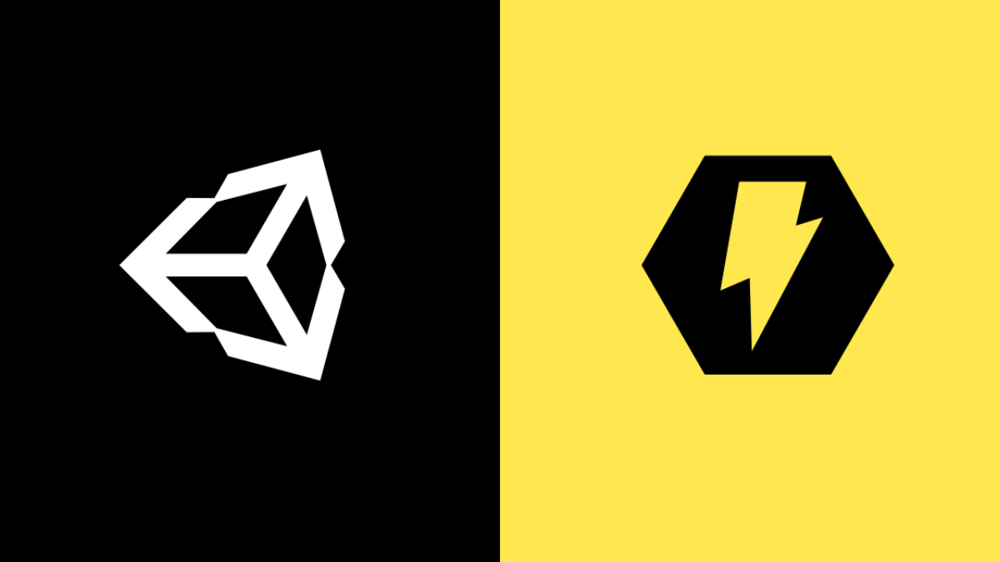

<!-- PROJECT SHIELDS -->
<!--
*** I'm using markdown "reference style" links for readability.
*** Reference links are enclosed in brackets [ ] instead of parentheses ( ).
*** See the bottom of this document for the declaration of the reference variables
*** for contributors-url, forks-url, etc. This is an optional, concise syntax you may use.
*** https://www.markdownguide.org/basic-syntax/#reference-style-links
-->
[![Contributors][contributors-shield]][contributors-url]
[![Forks][forks-shield]][forks-url]
[![Stargazers][stars-shield]][stars-url]
[![Issues][issues-shield]][issues-url]
[![MIT License][license-shield]][license-url]
[![LinkedIn][linkedin-shield]][linkedin-url]

<!-- PROJECT LOGO -->
 

  

  <h3 align="center">Unity Visual Scripting Test</h3>

  

  

    Testing out the visual scripting in Unity using Bolt
     
    <a href="https://github.com/BeeBeeCue/UnityBoltTest"><strong>Explore the docs »</strong></a>
     
     
    <a href="https://github.com/BeeBeeCue/UnityBoltTest">View Demo</a>
    ·
    <a href="https://github.com/BeeBeeCue/UnityBoltTest/issues">UnityBoltTestrt Bug</a>
    ·
    <a href="https://github.com/BeeBeeCue/UnityBoltTest/issues">Request Feature</a>
    

  

<!-- TABLE OF CONTENTS -->

  
<h2 style="display: inline-block">Table of Contents</h2>

  <ol>
    <li>
      <a href="#about-the-project">About The Project</a>
      <ul>
        <li><a href="#built-with">Built With</a></li>
      </ul>
    </li>
    <li>
      <a href="#getting-started">Getting Started</a>
      <ul>
        <li><a href="#prerequisites">Prerequisites</a></li>
        <li><a href="#installation">Installation</a></li>
      </ul>
    </li>
    <li><a href="#usage">Usage</a></li>
    <li><a href="#roadmap">Roadmap</a></li>
    <li><a href="#contributing">Contributing</a></li>
    <li><a href="#license">License</a></li>
    <li><a href="#contact">Contact</a></li>
    <li><a href="#acknowledgements">Acknowledgements</a></li>
  </ol>

<!-- ABOUT THE PROJECT -->
## About The Project

[![Product Name Screen Shot][product-screenshot]](https://example.com)

### Built With

* 
* 
* 

<!-- GETTING STARTED -->
## Getting Started

To get a local copy up and running follow these simple steps.

### Prerequisites

<!-- CONTACT -->
## Contact

Kristófer Kntusen - kristoferknutsen@hotmail.com - kristoferknutsen.com

Project Link: [https://github.com/BeeBeeCue/UnityBoltTest](https://github.com/BeeBeeCue/UnityBoltTest)

<!-- ACKNOWLEDGEMENTS -->
## Acknowledgements

* 
* 
* 

<!-- MARKDOWN LINKS & IMAGES -->
<!-- https://www.markdownguide.org/basic-syntax/#reference-style-links -->
[contributors-shield]: https://img.shields.io/github/contributors/BeeBeeCue/UnityBoltTest.svg?style=for-the-badge
[contributors-url]: https://github.com/BeeBeeCue/UnityBoltTest/graphs/contributors
[forks-shield]: https://img.shields.io/github/forks/BeeBeeCue/UnityBoltTest.svg?style=for-the-badge
[forks-url]: https://github.com/BeeBeeCue/UnityBoltTest/network/members
[stars-shield]: https://img.shields.io/github/stars/BeeBeeCue/UnityBoltTest.svg?style=for-the-badge
[stars-url]: https://github.com/BeeBeeCue/UnityBoltTest/stargazers
[issues-shield]: https://img.shields.io/github/issues/BeeBeeCue/UnityBoltTest.svg?style=for-the-badge
[issues-url]: https://github.com/BeeBeeCue/UnityBoltTest/issues
[license-shield]: https://img.shields.io/github/license/BeeBeeCue/UnityBoltTest.svg?style=for-the-badge
[license-url]: https://github.com/BeeBeeCue/UnityBoltTest/blob/master/LICENSE.txt
[linkedin-shield]: https://img.shields.io/badge/-LinkedIn-black.svg?style=for-the-badge&logo=linkedin&colorB=555
[linkedin-url]: https://www.linkedin.com/in/k-knutsen/
